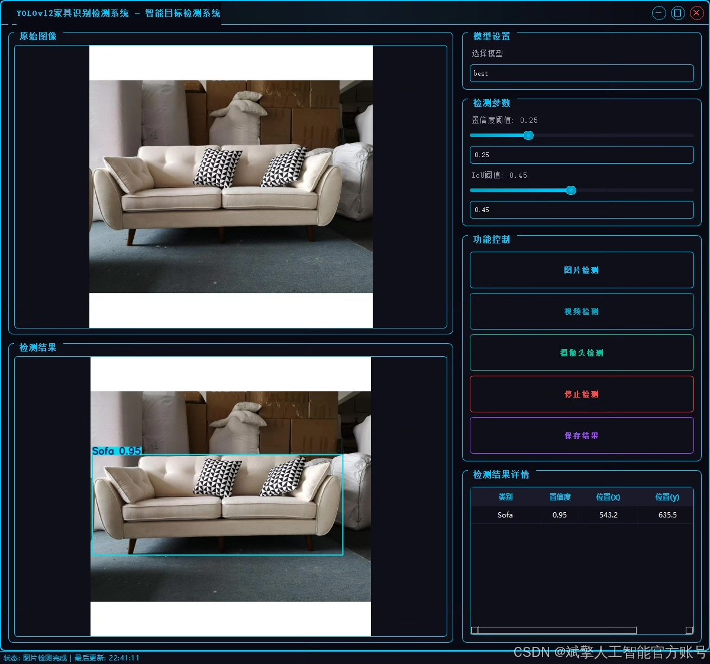
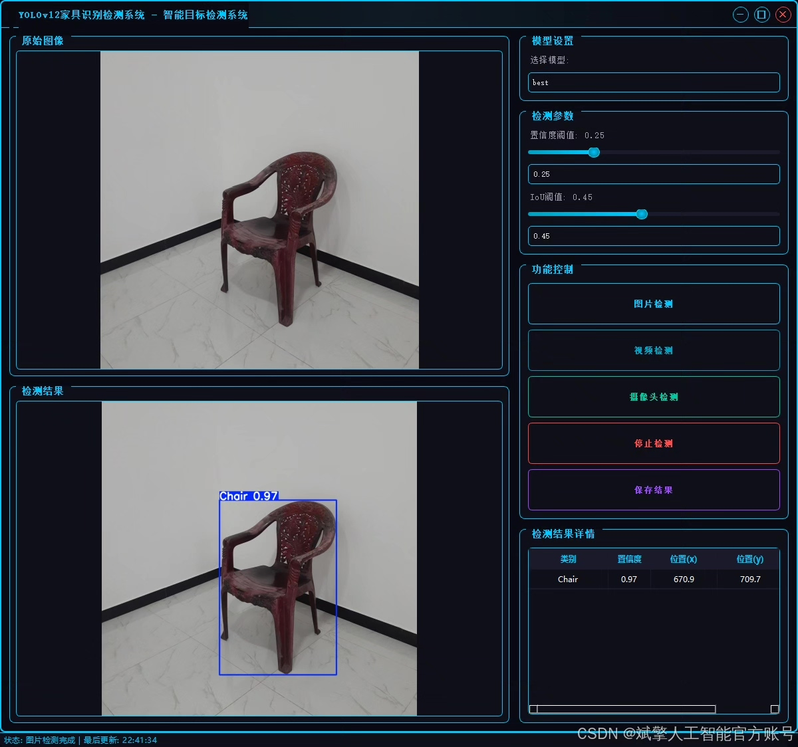
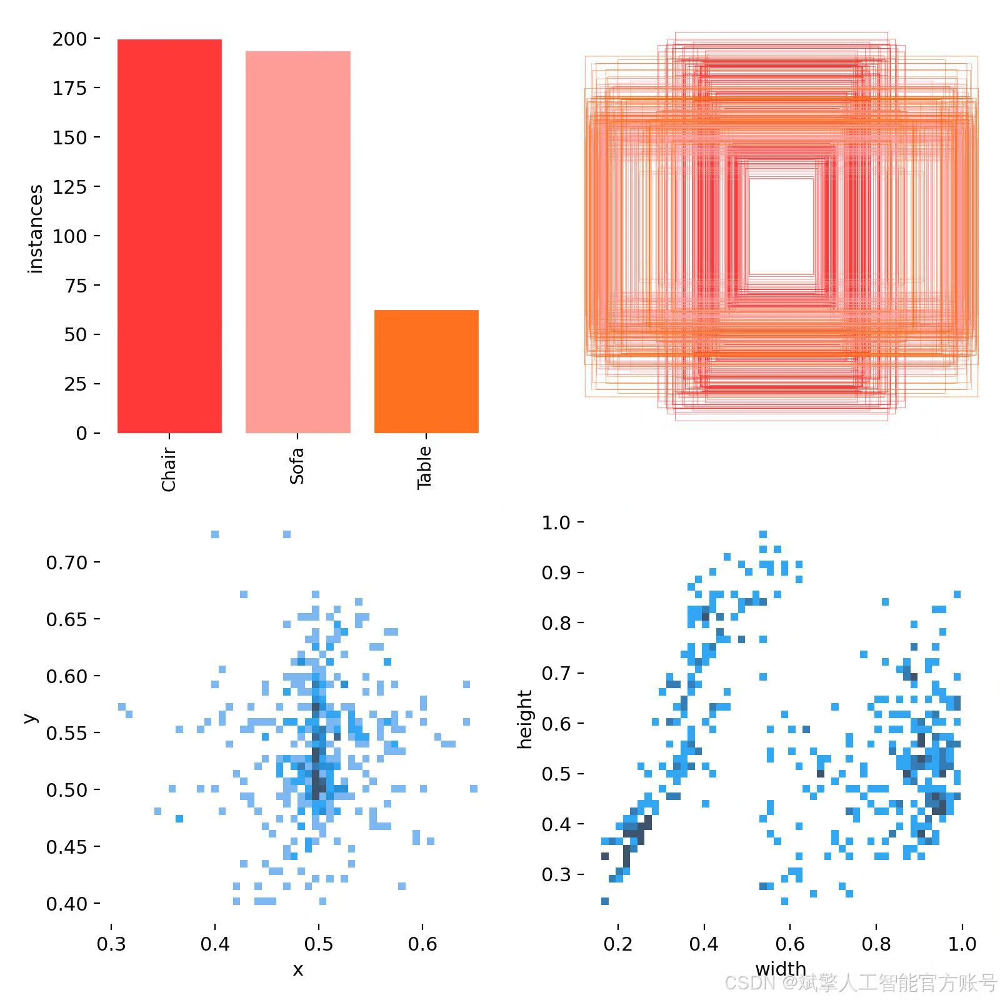
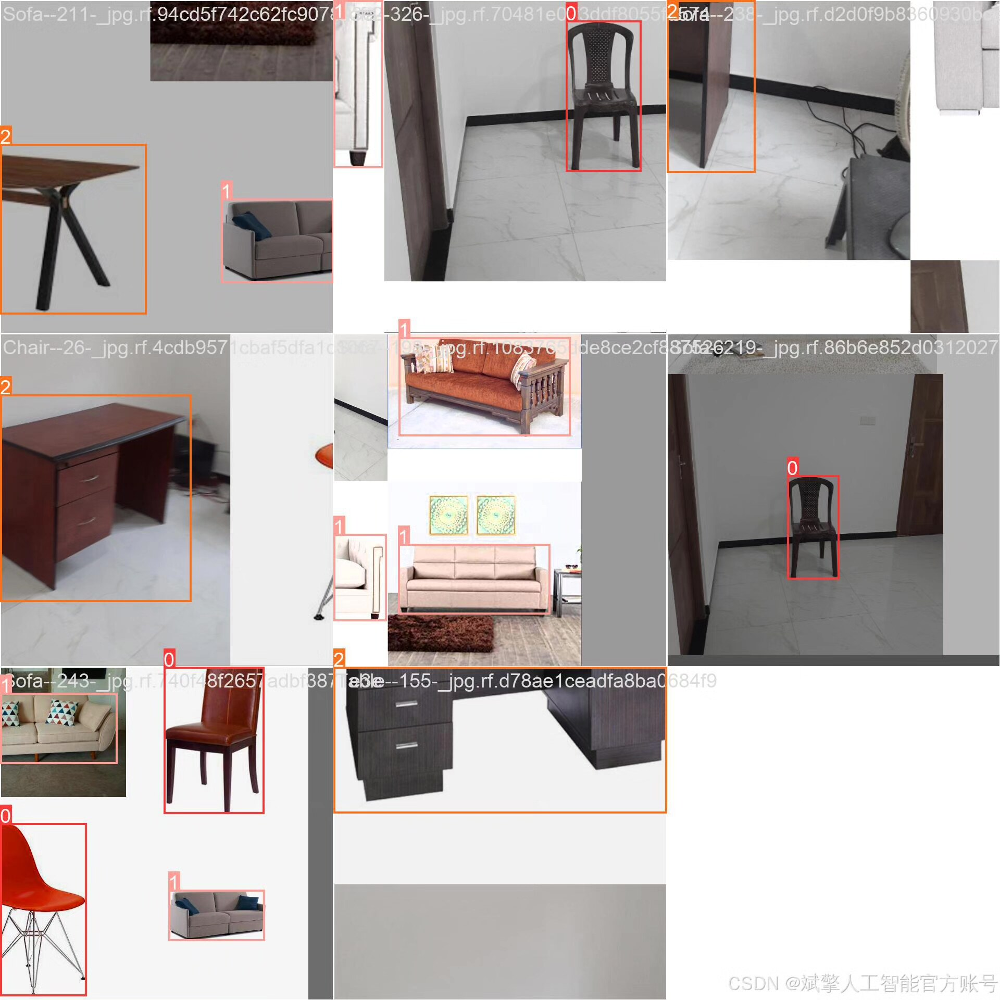
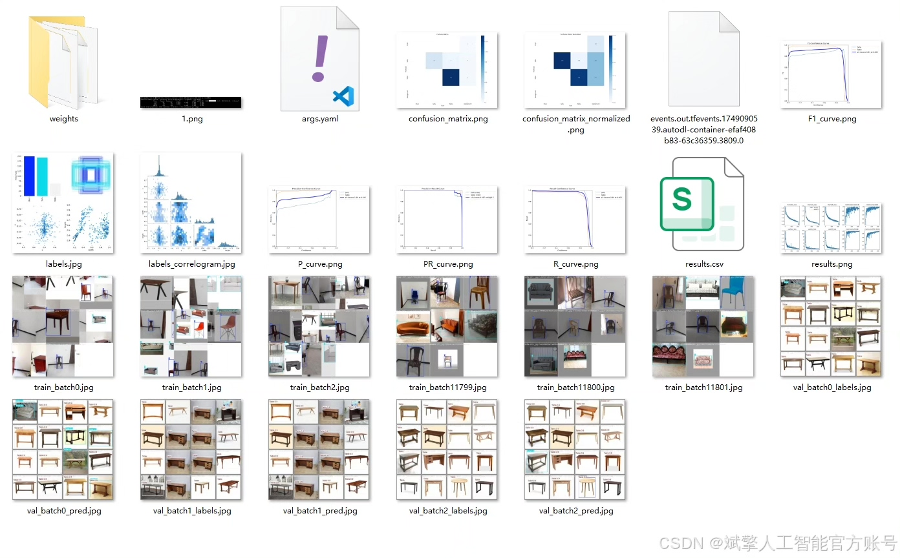
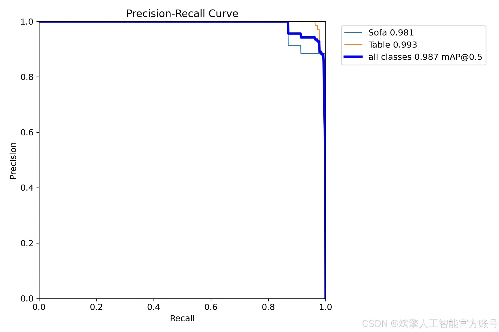
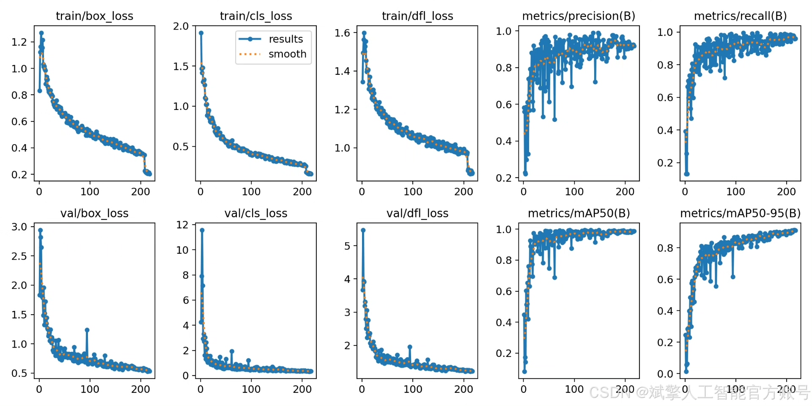
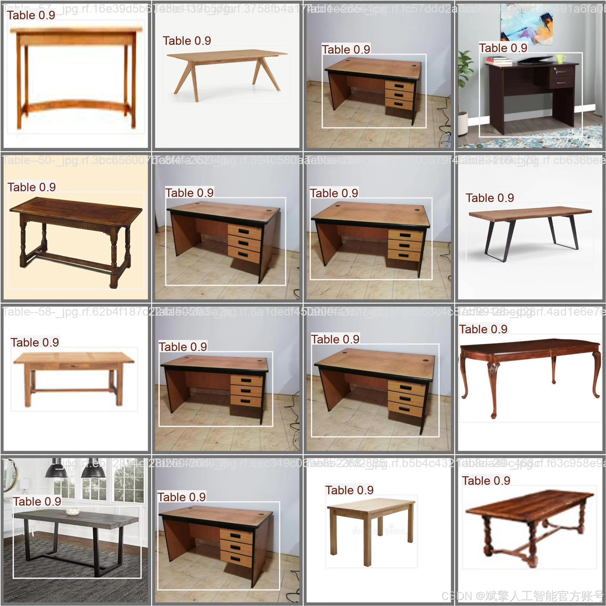

# YOLOv12 Furniture Recognition System

## Body

YOLOv12 Furniture Recognition System Based on Deep Learning YOLOv12: A Furniture Recognition and Detection System (YOLOv12+YOLO dataset + UI interface + login registration interface + Python project source code + model)

This paper proposes a furniture recognition and detection system based on deep learning YOLOv12, aiming to achieve efficient and accurate target detection for furniture. The system employs the YOLOv12 algorithm, combined with a custom YOLO format furniture dataset (comprising three categories of targets: chairs, sofas, and tables). The system is equipped with a user-friendly UI interface that supports login registration functions. Experimental results show that the system achieves high detection accuracy on the test set, with an mAP (mean average precision) of 98.7%, verifying the effectiveness of YOLOv12 in the task of furniture detection. This paper provides complete Python project source code, pre-trained models, and datasets, offering a reproducible solution for subsequent research and applications.

✅ User Login Registration: Supports password verification and security validation.
✅ Three detection modes: Based on the YOLOv12 model, supporting image, video, and real-time camera detection, accurately recognizing targets.
✅ Dual-screen comparison: Display original images and detection results simultaneously on the screen.
✅ Data visualization: Real-time table displaying the category, confidence, and coordinates of detected targets.
✅ Intelligent parameter adjustment: Offers a confidence slide bar for dynamic optimization of detection accuracy, adapting to different scene requirements.
✅ Sci-fi style interactive interface: Dark theme paired with dynamic light effects, reducing visual fatigue and enhancing operational experience.

## Images

## Payment

Here is a pay link on Stripe ( https://buy.stripe.com/3cs8yP7sY87d0vu9AB ). Please contact me lonlonago@foxmail.com after funding $89, and I will send you a complete data files , thank you!

